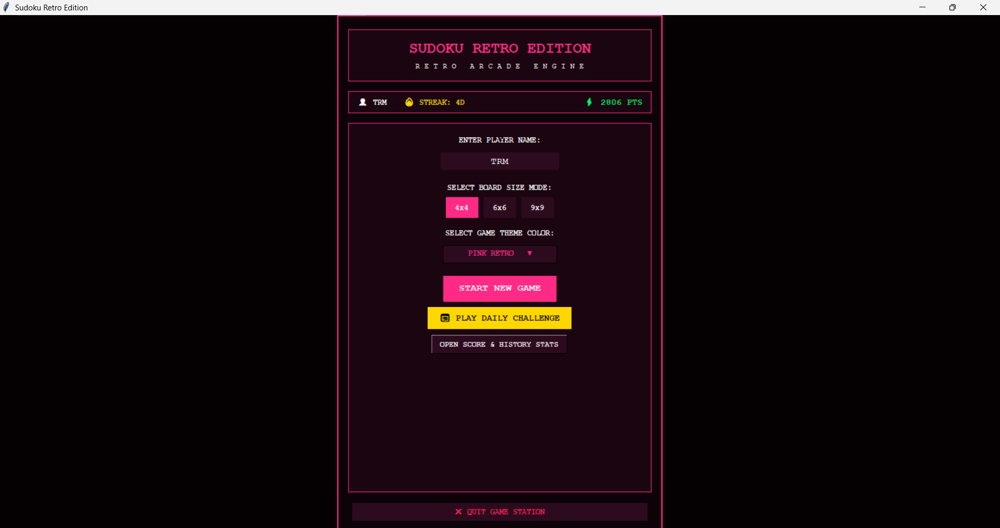
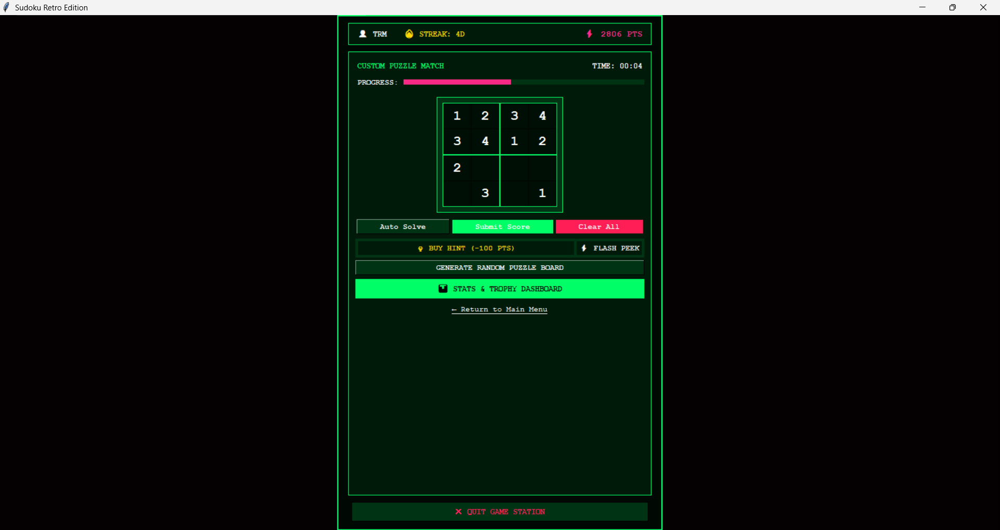
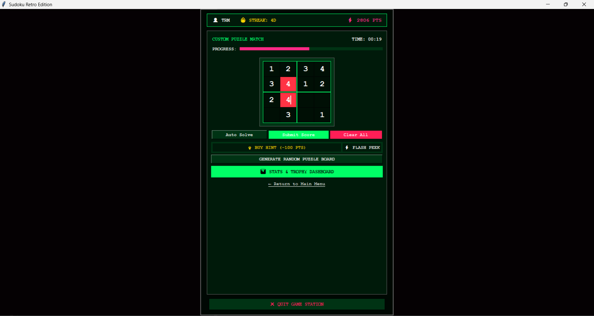
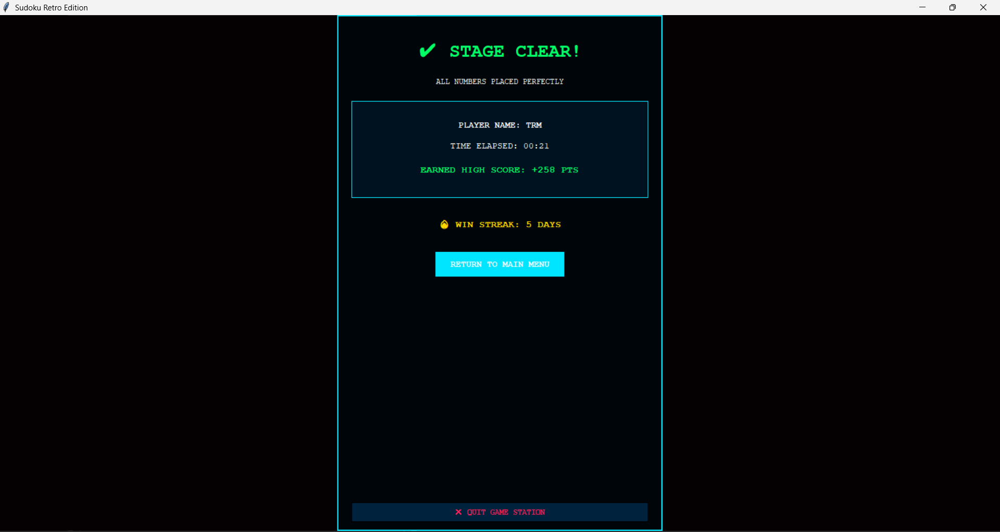
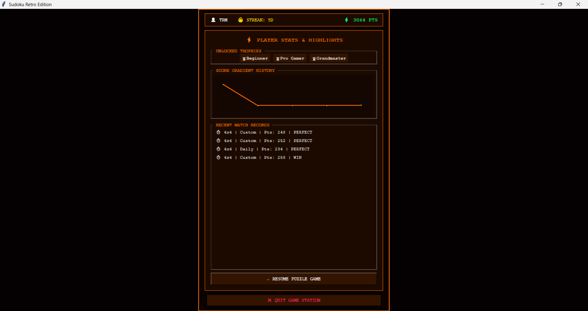

# 🧩 Sudoku Retro Edition

A feature-rich **Python Tkinter Sudoku game** featuring multiple board sizes, daily challenges, live validation, score tracking, achievements, performance analytics, and customizable retro-inspired themes. Built as part of the **SkillCraft Technology Software Development Internship (Task 3)**.

---

## 📌 Project Overview

Sudoku Retro Edition delivers a classic Sudoku experience with a modern retro interface. The application supports multiple board sizes, intelligent puzzle solving, real-time error detection, player statistics, score history, and personalized themes—all within an interactive desktop application developed using Python and Tkinter.

---

## ✨ Features

* 🎮 Interactive Sudoku gameplay
* 📐 Multiple board sizes (4×4, 6×6, 9×9)
* 📅 Daily Challenge mode
* 🤖 Auto Sudoku Solver (Backtracking Algorithm)
* 💡 Smart Hint System
* ⚡ Flash Peek feature
* ⏱️ Live Timer
* 📊 Real-time Progress Bar
* ❌ Live Conflict Detection
* 🏆 Score & Streak Tracking
* 📈 Performance Dashboard
* 📉 Score History Graph
* 🏅 Achievement Badges
* 🎨 Multiple Retro Themes
* 💾 Persistent Player Profile (JSON Storage)
* 📜 Match History
* 🚪 Secure Exit Confirmation

---

## 🛠️ Technologies Used

* Python 3
* Tkinter
* JSON
* Object-Oriented Programming (OOP)
* Backtracking Algorithm

---

## 📂 Project Structure

```text
SCT_SD_3/
│
├── sudoku_solver.py          # Main Sudoku application
├── quantum_profile.json      # Stores player profile and history
│
├── screenshots/
│   ├── shome.png
│   ├── sgame.png
│   ├── serror.png
│   ├── sscore.png
│   └── shist.png
│
└── README.md
```

---

## 📸 Screenshots

### 🏠 Home Screen



---

### 🎮 Gameplay



---

### ❌ Live Error Detection



---

### 🏆 Score Screen



---

### 📊 Statistics & History



---

## 🚀 How to Run

### 1. Clone the repository

```bash
git clone https://github.com/your-username/SCT_SD_3.git
```

### 2. Navigate to the project folder

```bash
cd SCT_SD_3
```

### 3. Run the application

```bash
python sudoku_solver.py
```

---

## 🎯 Gameplay

1. Enter your player name.
2. Select a board size (4×4, 6×6, or 9×9).
3. Choose your preferred retro theme.
4. Start a custom game or Daily Challenge.
5. Solve the puzzle while avoiding conflicts.
6. Use hints or Auto Solve whenever needed.
7. Submit your solution to receive your score.
8. View achievements, graphs, and history from the dashboard.

---

## 📊 Scoring System

* Points are awarded for correctly solving puzzles.
* Faster completion earns higher scores.
* Winning increases your solve streak.
* Smart Hints deduct points.
* Auto Solve completes the puzzle but does not award a winning score.

---

## 💾 Data Persistence

Player information is automatically saved in:

```text
quantum_profile.json
```

This stores:

* Player Name
* Theme Preference
* Total Points
* Solve Streak
* Match History
* Dashboard Statistics

---

## 📚 Concepts Demonstrated

* Object-Oriented Programming
* GUI Development with Tkinter
* File Handling
* JSON Data Storage
* Recursive Backtracking
* Event Handling
* Input Validation
* Real-Time UI Updates

---

## 🌟 Future Improvements

* Difficulty Levels
* Undo / Redo
* Pencil (Notes) Mode
* Sound Effects
* PDF Report Export
* Dark / Light Mode Toggle
* XP & Level System
* Leaderboard
* Resume Last Game

---

## 👨‍💻 Author

**Sarudharshini B**

Software Development Intern — SkillCraft Technology

---

## 📄 License

This project is developed for educational and learning purposes as part of the SkillCraft Technology Software Development Internship.
